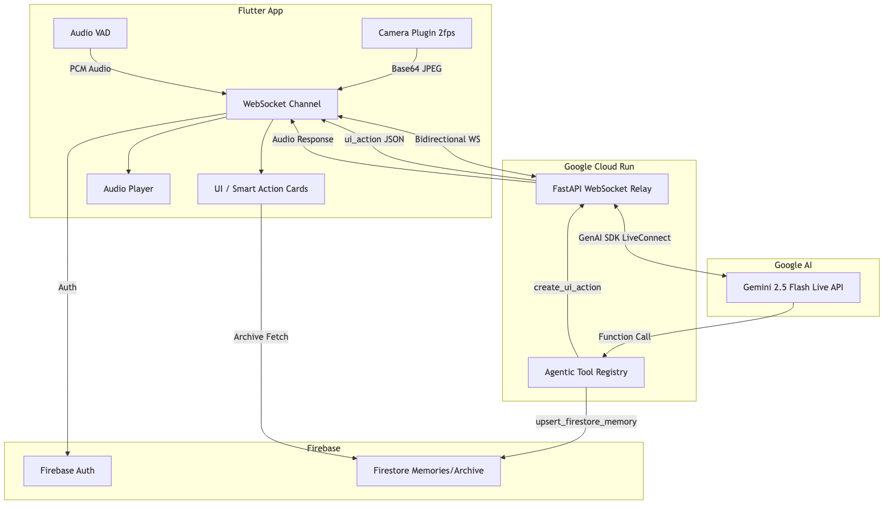

#  Arqivon — The Living Lens

> **A real-time, multimodal Live Agent that sees what you see, hears what you hear, and acts before you ask.**

**Category:** Live Agents  
**Hackathon:** [Gemini Live Agent Challenge](https://geminiliveagentchallenge.devpost.com) `#GeminiLiveAgentChallenge`

---

## The Problem

Current AI assistants are trapped behind a text box. You type, wait, read. But real life doesn't pause for you to type — you're holding groceries while reading a foreign menu, staring at a math problem on a whiteboard, or troubleshooting a device with both hands full. The world is **multimodal**; your AI assistant should be too.

## The Solution

**Arqivon** transforms your phone into an intelligent **Living Lens**. Point your camera at anything — a document in another language, a math problem, a broken appliance — and Arqivon **simultaneously** processes your **live video feed** and **continuous voice** through the **Gemini Live API**. It doesn't just describe what it sees; it **takes action** through 17 agentic tools, creates exportable PDFs, and remembers context across sessions.

### What Makes Arqivon Different

| Feature | Traditional AI | Arqivon |
|---------|---------------|---------|
| Input | Text only | Simultaneous voice + camera (2fps JPEG + 16kHz PCM) |
| Interaction | Turn-based | Real-time with barge-in (native VAD) |
| Output | Text response | Voice + UI cards + translations + PDF exports |
| Context | Single session | Persistent memory via Firestore |
| Specialization | One-size-fits-all | 4 mode-specific agent personas with dedicated tools |

---

## Four Specialized Agent Modes

| Mode | What It Does | Key Tools |
|------|-------------|-----------|
| **Assistant** ✨ | Proactive multimodal assistant — detects actionable items in your camera feed, creates Smart Action Cards, maintains persistent memory | `analyze_live_frame`, `create_ui_action`, `upsert_firestore_memory` |
| **Translator** 🌐 | Broadcast-quality real-time translator — handles 100+ languages, document translation via camera, PDF export of translations | `live_translate`, `detect_language`, `translation_card`, `export_document` |
| **Tutor** 🎓 | Vision-enabled genius tutor — solves math/science/any subject fully, shows step-by-step solutions, grades work, exports solutions as PDF | `analyze_homework`, `solve_problem`, `explain_concept`, `provide_hint`, `grade_step`, `tutor_card`, `export_document` |
| **Support** 🎧 | Elite customer support agent — tracks conversation topics, escalates cases, logs resolutions, exports support notes | `switch_topic`, `escalate_case`, `log_resolution`, `support_card`, `export_document` |

---

## Google Cloud & Gemini Technologies Used

| Technology | How We Use It |
|-----------|--------------|
| **Gemini Live API** (`gemini-2.5-flash-native-audio-latest`) | Real-time bidirectional audio + vision via `google-genai` SDK `aio.live.connect()` with native audio output |
| **Google GenAI SDK** (`google-genai>=1.64.0`) | `send_realtime_input()`, `send_client_content()`, `send_tool_response()` for multimodal streaming |
| **Google Cloud Run** | Production container hosting — min 1 instance (zero cold starts), 1hr WebSocket timeout, CPU always-on |
| **Cloud Firestore** | Sessions, persistent memories, translations, solutions, support topics, exported documents |
| **Firebase Auth** | Google Sign-In authentication with Firebase Admin SDK verification |
| **Secret Manager** | `GEMINI_API_KEY` secret injection into Cloud Run |
| **Container Registry** | Docker image storage for Cloud Run deployments |
| **Cloud Storage** | Media caching for camera frames and audio |

---

## Architecture



```
┌──────────────────────┐   Bidirectional WebSocket    ┌─────────────────────────┐
│    Flutter App        │ ◄──────────────────────────► │   FastAPI on Cloud Run  │
│    (Riverpod)         │  audio PCM + JPEG frames →   │                         │
│                       │  ← audio + UI actions +      │  ┌───────────────────┐  │
│  ┌────────────────┐   │    translations + tutor       │  │ Mode-Aware System │  │
│  │ Mode Selector  │   │    steps + exports            │  │ Prompts           │  │
│  ├────────────────┤   │                               │  ├───────────────────┤  │
│  │ Camera 2fps    │   │                               │  │ Tool Registry     │  │
│  ├────────────────┤   │                               │  │ (17 tools)        │  │
│  │ Mic 16kHz PCM  │   │                               │  ├───────────────────┤  │
│  ├────────────────┤   │                               │  │ Gemini Live       │  │
│  │ Mode-Specific  │   │                               │  │ Session           │  │
│  │ UI Overlays    │   │                               │  │ (per-user)        │  │
│  ├────────────────┤   │                               │  ├───────────────────┤  │
│  │ PDF Export     │   │                               │  │ Firestore         │  │
│  └────────────────┘   │                               │  └───────────────────┘  │
└────────┬──────────────┘                               └───────┬─────────────────┘
         │           Firebase Auth / Firestore                  │
         └──────────────────────────────────────────────────────┘
```

### Data Flow

1. **User speaks + points camera** → Flutter captures 16kHz PCM audio + 2fps JPEG frames
2. **WebSocket** → Sends both streams simultaneously to FastAPI backend on Cloud Run
3. **Backend** → Relays to Gemini Live API via `google-genai` SDK `aio.live.connect()`
4. **Gemini** → Processes multimodal input, invokes function calls (17 registered tools)
5. **Tool Registry** → Dispatches tool calls, routes typed results back to client
6. **Client** → Renders mode-specific overlays (translation subtitles, tutor steps, export cards)
7. **Audio response** → Gemini's native audio streams back through WebSocket to client speaker

---

## Live Agent Features (Category-Specific)

### Real-Time Interaction
- **Barge-in / Interruption:** Native VAD — interrupt the agent mid-sentence and it instantly re-focuses
- **Continuous streaming:** Audio and video flow simultaneously, not turn-based
- **Mode switching:** Change agent persona mid-session without disconnecting

### Distinct Persona / Voice
- Each mode has a completely different system prompt and personality
- Mode-specific tool declarations — agents only see tools relevant to their role
- Visual identity via mode-colored UI accents (Indigo/Amber/Emerald/Blue)

### Error Handling
- WebSocket reconnection with exponential backoff (5 attempts, jitter)
- 12-second heartbeat keeps connections alive
- Graceful Gemini session recovery on API timeouts
- Force-restart audio recorder on Android audio focus changes

---

## Project Structure

```
Arqivon/
├── backend/                          # Python FastAPI backend
│   ├── main.py                       # WebSocket relay + Gemini Live sessions (855 LOC)
│   ├── tool_registry.py              # 17 agentic tools across 4 modes (675 LOC)
│   ├── models.py                     # Pydantic schemas (AgentMode, messages, sessions)
│   ├── config.py                     # Environment-based settings
│   ├── requirements.txt              # Python dependencies
│   ├── Dockerfile                    # Multi-stage Cloud Run container
│   ├── service.yaml                  # Cloud Run Knative deployment config
│   └── .env.example                  # Required env vars template
├── app/                              # Flutter mobile app
│   ├── pubspec.yaml
│   └── lib/
│       ├── main.dart                 # App entry, auth gate, navigation
│       ├── config/
│       │   ├── constants.dart        # Backend URL, audio/video settings
│       │   └── theme.dart            # Material 3 light/dark themes
│       ├── models/
│       │   ├── agent_mode.dart       # AgentMode enum + TutorStep, TranslationOverlay,
│       │   │                         #   SupportTopic, ExportDocument models
│       │   ├── ws_message.dart       # WebSocket message types
│       │   ├── smart_action.dart     # Smart Action Card model
│       │   └── session_model.dart    # Archive session model
│       ├── services/
│       │   ├── websocket_service.dart    # Production WS with backoff
│       │   ├── audio_service.dart        # Mic capture (16kHz PCM) + playback
│       │   ├── auth_service.dart         # Firebase Auth + Google Sign-In
│       │   ├── export_service.dart       # PDF generation + sharing
│       │   └── firestore_service.dart    # Sessions & memories CRUD
│       ├── providers/
│       │   ├── live_session_provider.dart # Mode-aware AsyncNotifier (core)
│       │   ├── settings_provider.dart    # Theme, voice, mode, language
│       │   ├── session_provider.dart     # Archive session list
│       │   ├── auth_provider.dart        # Auth state
│       │   └── firebase_provider.dart    # Firebase init
│       ├── widgets/
│       │   ├── tutor_guidance_card.dart      # Step-by-step tutor card with solutions
│       │   ├── translation_overlay.dart      # Live translation subtitle card
│       │   ├── export_document_card.dart     # PDF export card
│       │   ├── smart_action_card.dart        # Expandable action cards
│       │   ├── support_topic_tracker.dart    # Topic trail tracker
│       │   ├── live_wave.dart               # Animated orb/wave visualizer
│       │   ├── audio_visualizer.dart        # Waveform bars
│       │   ├── mode_selector.dart           # Horizontal mode picker
│       │   ├── connection_indicator.dart    # Connection status dot
│       │   ├── glassmorphic_card.dart       # Frosted-glass card wrapper
│       │   └── session_tile.dart            # Mode-colored archive tiles
│       └── screens/
│           ├── live_screen.dart         # Camera + audio + mode overlays (889 LOC)
│           ├── home_screen.dart         # Home tab with mode selector
│           ├── login_screen.dart        # Google/Apple Sign-In
│           ├── settings_screen.dart     # Settings
│           └── archive_screen.dart      # Past sessions with mode filter
├── firebase/
│   ├── firestore.rules                 # Strict uid-based data isolation
│   ├── storage.rules                   # User-scoped media (10MB max)
│   └── firebase.json                   # Firebase project config
├── deploy.sh                           # Automated Cloud Run deployment script
├── architecture.mmd                    # Mermaid diagram source
├── architecture.png                    # Rendered architecture diagram
├── demo_storyboard.md                  # Demo video script
├── landing/                            # Landing page + Privacy Policy + Terms of Service
│   ├── index.html
│   ├── privacy.html
│   ├── terms.html
│   └── firebase.json
└── README.md                           # This file
```

**Codebase:** ~10,600 lines across 44 source files (39 Dart + 5 Python) — plus 1,067 lines of tests (99 unit tests, 7 test files)

---

## Spin-Up Instructions

### Prerequisites

- Flutter 3.x SDK ([install](https://docs.flutter.dev/get-started/install))
- Python 3.11+
- A Gemini API key from [Google AI Studio](https://aistudio.google.com/apikey)
- A Firebase project with Auth + Firestore enabled
- Google Cloud SDK (`gcloud`) installed

### 1. Clone the Repository

```bash
git clone https://github.com/Medialordofficial/Arqivon.git
cd Arqivon
```

### 2. Backend — Local Development

```bash
cd backend
python -m venv .venv && source .venv/bin/activate
pip install -r requirements.txt

# Configure environment
cp .env.example .env
# Edit .env and add your GEMINI_API_KEY

# Run locally
uvicorn main:app --reload --port 8080
```

Verify: `curl http://localhost:8080/health` → `{"status": "ok"}`

### 3. Backend — Deploy to Google Cloud Run

```bash
# Option A: Use the automated deploy script
chmod +x deploy.sh
./deploy.sh

# Option B: Manual deployment
cd backend
gcloud run deploy arqivon-backend \
  --source . \
  --region us-central1 \
  --allow-unauthenticated \
  --set-secrets=GEMINI_API_KEY=GEMINI_API_KEY:latest \
  --max-instances=10 \
  --min-instances=1 \
  --no-cpu-throttling \
  --timeout=3600 \
  --concurrency=100 \
  --memory=512Mi \
  --cpu=1 \
  --project=arqivon-inc
```

### 4. Flutter App

```bash
cd app
flutter pub get

# Update WebSocket URL in lib/config/constants.dart
# to point to your Cloud Run service URL

# Run on connected device
flutter run

# Or build APK
flutter build apk --debug
```

### 5. Firebase Setup

```bash
# Install FlutterFire CLI
dart pub global activate flutterfire_cli

# Configure Firebase for your project
cd app && flutterfire configure
```

Deploy Firestore rules:
```bash
cd firebase
firebase deploy --only firestore:rules,storage
```

### 6. Landing Page (Privacy Policy & Terms)

The landing page, privacy policy, and terms of service are hosted on Firebase Hosting:

```bash
cd landing
firebase deploy --only hosting --project arqivon-inc
```

**Live URLs:**
- Landing: https://arqivon-inc.web.app
- Privacy Policy: https://arqivon-inc.web.app/privacy
- Terms of Service: https://arqivon-inc.web.app/terms

---

## Proof of Google Cloud Deployment

Our backend runs on **Google Cloud Run** at:  
`https://arqivon-backend-653546103163.us-central1.run.app`

**Evidence in code:**
- [`backend/Dockerfile`](backend/Dockerfile) — Multi-stage Docker build for Cloud Run
- [`backend/service.yaml`](backend/service.yaml) — Cloud Run Knative service configuration
- [`app/lib/config/constants.dart`](app/lib/config/constants.dart) — WebSocket URL pointing to Cloud Run
- [`deploy.sh`](deploy.sh) — Automated Cloud Run deployment script

**Google Cloud services visible in code:**
- [`backend/main.py`](backend/main.py) — `google.genai` SDK for Gemini Live API, Firebase Admin SDK for auth + Firestore
- [`backend/config.py`](backend/config.py) — Secret Manager integration for `GEMINI_API_KEY`
- [`backend/tool_registry.py`](backend/tool_registry.py) — Firestore writes for memories, translations, solutions, exports

---

## Devpost Submission Assets

To make judging fast and clear, these prepared assets are included:

- [`docs/DEVPOST_SUBMISSION_PACKAGE.md`](docs/DEVPOST_SUBMISSION_PACKAGE.md) — requirement-to-evidence mapping for the Gemini Live Agent Challenge
- [`docs/DEMO_VIDEO_SCRIPT_LIVE_AGENTS.md`](docs/DEMO_VIDEO_SCRIPT_LIVE_AGENTS.md) — judge-focused <4-minute narration + shot list
- [`demo_storyboard.md`](demo_storyboard.md) — alternate visual-first storyboard
- [`architecture.png`](architecture.png) + [`architecture.svg`](architecture.svg) + [`architecture.mmd`](architecture.mmd) — architecture diagram pack
- [`QA_LIVE_CONVERSATION_STRESS_CHECKLIST.md`](QA_LIVE_CONVERSATION_STRESS_CHECKLIST.md) — reliability gate for interruption and long-session flow

---

## Tool Registry — 17 Agentic Tools

| Category | Tool | Purpose |
|----------|------|---------|
| **Shared** (all modes) | `analyze_live_frame` | Analyze camera frame via Gemini vision |
| | `upsert_firestore_memory` | Save persistent memory to Firestore |
| | `create_ui_action` | Render Smart Action Card in Flutter UI |
| **Translator** | `live_translate` | Real-time translation with subtitle overlay |
| | `detect_language` | Language detection from speech/text |
| | `translation_card` | Saveable translation flashcard |
| | `export_document` | Export translations as PDF |
| **Tutor** | `analyze_homework` | Analyze homework/diagram from camera |
| | `solve_problem` | Complete step-by-step solution with final answer |
| | `explain_concept` | Rich concept explanation with examples |
| | `provide_hint` | Contextual hint without full answer |
| | `grade_step` | Grade student's work step-by-step |
| | `tutor_card` | Render progress/guidance card |
| | `export_document` | Export solutions as PDF |
| **Support** | `switch_topic` | Track mid-conversation topic changes |
| | `escalate_case` | Escalate unresolvable cases |
| | `log_resolution` | Log resolution outcome + satisfaction |
| | `support_card` | Render contextual support card |
| | `export_document` | Export support notes as PDF |

---

## Third-Party Integrations

| Integration | License | Usage |
|-------------|---------|-------|
| Flutter SDK | BSD-3-Clause | Mobile app framework |
| Riverpod | MIT | State management |
| FastAPI | MIT | Python backend framework |
| `google-genai` | Apache-2.0 | Google Gemini API SDK |
| `firebase-admin` | Apache-2.0 | Firebase Admin SDK for Python |
| Firebase SDKs | Apache-2.0 | Auth, Firestore, Storage |
| `pdf` (Dart) | Apache-2.0 | PDF generation |
| `share_plus` | BSD-3-Clause | Native share sheet |
| `record` | MIT | Audio recording |
| `just_audio` | MIT | Audio playback |
| `camera` | BSD-3-Clause | Camera access |
| `glassmorphism` | MIT | Frosted glass UI effects |

All packages used under their respective open-source licenses.

---

## How It Was Built

1. **Mode-Aware Backend:** FastAPI manages per-user WebSocket connections, each spawning a Gemini Live API session with mode-specific system prompts and tool declarations. Three concurrent asyncio coroutines handle client→Gemini, Gemini→client, and heartbeat. Mode/language switching triggers live session reconnection with the correct persona.

2. **Tool Registry:** `tool_registry.py` declares 17 `FunctionDeclaration` objects across 4 categories. When Gemini invokes a tool, the backend dispatcher routes it to the correct handler, converts results to typed outbound messages (`TRANSLATION`, `TUTOR_STEP`, `SUPPORT_TOPIC`, `UI_ACTION`, `EXPORT`), and sends tool responses back to Gemini via `send_tool_response()`.

3. **Flutter State:** `LiveSessionNotifier` (Riverpod `AutoDisposeAsyncNotifier`) owns the full lifecycle: connect → set mode → stream audio/video → receive mode-specific responses → render overlay widgets → persist session on disconnect. The `TabIndexNotifier` ensures audio/video stops when navigating away.

4. **Mode-Specific UI:** Each mode gets its own overlay widget: `TranslationOverlayWidget` (source→target with formality), `TutorGuidanceCard` (numbered solution steps, final answer box, concept examples), `SupportTopicTracker` (topic trail), `ExportDocumentCard` (PDF preview + share). The `ModeSelectorStrip` enables instant mode switching.

5. **PDF Export Pipeline:** When Gemini calls `export_document`, the backend routes the content to the client as an `EXPORT` message. The Flutter `ExportService` generates a formatted PDF using the `pdf` package and opens the native share sheet via `share_plus`.

6. **Production Resilience:** WebSocket service implements exponential backoff with jitter (5 attempts). Backend heartbeat (12s interval) keeps Cloud Run connections alive. Audio recorder force-restarts on Android audio focus changes. Fresh `AudioPlayer` per AI turn prevents playback bugs.

---

## Findings & Learnings

- **Gemini Live API SDK migration:** The `session.send()` method was deprecated in `google-genai>=1.64.0`. Migrated to `send_realtime_input()` for audio/video, `send_client_content()` for text, and `send_tool_response()` for function call results.
- **Android audio focus:** The `record` plugin silently dies when another app steals audio focus. Fixed with a force-restart mechanism in `ensureRecording()`.
- **Cloud Run WebSocket timeout:** Default 5-minute timeout kills long conversations. Set to 3600s with `--no-cpu-throttling` and `--min-instances=1` for always-on behavior.
- **Multimodal rate limiting:** Sending camera frames at >3fps triggers Gemini rate limits. Settled on 2fps as the sweet spot for real-time vision without throttling.

---

## License

MIT